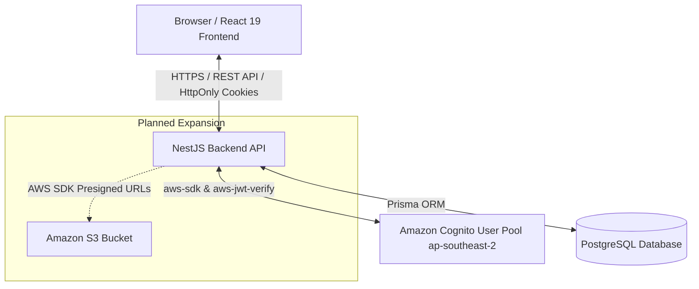

# Startups Blogs - Business Investment Connection Platform
## A Unified Platform for Startup & Business Investment Connection

---

### 1. Executive Summary
**Startups Blogs** is a modern web application designed to bridge the connection gap between Startups, Small and Medium Enterprises (SMEs), Business Owners, Investors, and Enterprise Partners.

The platform enables businesses to build detailed identity profiles, publish funding opportunities, clarify use-of-fund roadmaps, and attract capital. Simultaneously, investors can effortlessly discover, filter, and evaluate investment opportunities through a clean, structured interface.

The project has established a full-stack foundation with **React 19 (Vite, TypeScript)** on the frontend, **NestJS (REST API, TypeScript)** on the backend, **PostgreSQL & Prisma ORM** at the data layer, and integrated **Amazon Cognito User Pool (`ap-southeast-2`)** for secure authentication via HttpOnly cookies.

---

### 2. Problem Statement

#### Current Challenges
- **Fragmented Investment Information**: Startups and SMEs face difficulties connecting with suitable investors. Business information and funding requirements are often scattered across social media, spreadsheets, and private channels.
- **Unstructured Evaluation Data**: Investors lack a centralized, standardized platform to search, compare, and evaluate financial highlights, founding teams, and deal parameters.
- **Security & Authorization Risks**: Investment documents contain restricted data requiring strict authentication and fine-grained access control.

#### Proposed Solution
**Startups Blogs** provides a centralized ecosystem:
- **Businesses**: Register accounts, verify email, manage business identities, publish funding opportunities, and present capital requirements.
- **Investors**: Register investor accounts, explore business listings, filter opportunities by industry/stage/amount, and review structured data.
- **Security Architecture**: Utilizes **Amazon Cognito**, **HttpOnly Cookies**, and **JWT Verification (`aws-jwt-verify`)** at NestJS backend for session security.

---

### 3. Benefits & ROI
- **Streamlined Connection**: Reduces match-making time between startups and investors from months to days via smart search and filtering.
- **Transparent Profiles**: Standardizes business overview data, Use of Funds breakdown, and Financial Highlights.
- **Enterprise-Grade Security**: Delegating authentication to Amazon Cognito eliminates local password storage risks and protects against XSS/CSRF via HttpOnly cookies.

---

### 4. Solution Architecture

#### Authentication Flow
1. **Registration**: User selects role (`BUSINESS_OWNER`, `INVESTOR`, `ENTERPRISE_PARTNER`) → NestJS issues `SignUpCommand` to Cognito → Cognito sends 6-digit email code → User confirms (`ConfirmSignUpCommand`) → User activated in PostgreSQL.
2. **Login**: User enters credentials → NestJS calculates `SECRET_HASH` (HMAC-SHA256) and calls Cognito `USER_PASSWORD_AUTH` → Cognito returns tokens → NestJS sets **HttpOnly Signed Cookies** (`sb_access_token`, `sb_id_token`, `sb_refresh_token`).
3. **Session Validation (`/auth/me`)**: Frontend sends request with HttpOnly cookie → NestJS `CognitoAuthGuard` verifies RSA signature against Cognito JWKS via `aws-jwt-verify` → Retrieves user profile safely from PostgreSQL.

---

### 5. Technology Stack

#### Frontend (Implemented)
- **React 19**, **TypeScript**, **Vite**
- **React Router v7** navigation
- **CSS Modules** styling
- **AuthContext** & Custom Hooks for state management

#### Backend (Implemented)
- **NestJS**, **TypeScript**
- **Prisma ORM** for database mapping
- **PostgreSQL** database
- **@aws-sdk/client-cognito-identity-provider** & **aws-jwt-verify**
- **@nestjs/throttler** rate limiting

#### AWS Infrastructure (Implemented & Planned)
- **Amazon Cognito (`ap-southeast-2`)**: *IMPLEMENTED* (User Pool, Client App, Email verification, Token lifecycle).
- **Amazon S3**: *PLANNED* (Business logo upload, cover images, funding document storage via Presigned URLs).
- **Production AWS Deployment**: *PLANNED* (Future production AWS deployment architecture — to be finalized).

---

### 6. Feature Status Breakdown

| Feature / Module | Implementation Status | Notes |
| --- | :---: | --- |
| PostgreSQL Database & Prisma Schema | **IMPLEMENTED** | Schema created for User, Business, FundingOpportunity, InvestorProfile, Industry, TeamMember |
| Read-Only REST APIs | **IMPLEMENTED** | `GET /businesses`, `GET /funding-opportunities`, `GET /investors`, `GET /taxonomies/*` |
| Amazon Cognito Auth Backend | **IMPLEMENTED** | Register, Login, Email Verification, Session Refresh, Logout, Password Reset |
| HttpOnly Signed Cookies & JWT Guard | **IMPLEMENTED** | Uses `aws-jwt-verify` against Cognito JWKS |
| React UI Pages & AuthContext | **IMPLEMENTED** | Home, Explore, Details, Login, Register, Verify Email, Password Reset |
| 8-Step Raise Capital Wizard | **IMPLEMENTED (FRONTEND)** | 8-step wizard with validation and `localStorage` draft persistence |
| Route Authorization Guard | **IMPLEMENTED** | `/raise-capital` route restricted to `BUSINESS_OWNER` & `ENTERPRISE_PARTNER` |
| PostgreSQL Raise Capital Persistence | **PLANNED** | Backend `POST/PUT` write APIs for Business / Funding Opportunities |
| Amazon S3 File Uploads | **PLANNED** | Presigned URL file uploads for logos and documents |
| Document Access & Messaging | **PLANNED** | Investor-to-business contact requests and private document access |
| Admin Moderation Dashboard | **PLANNED** | Administrative approval workflows for pending listings |

> **Note on ADMIN role**: Public self-registration is strictly restricted to `BUSINESS_OWNER`, `INVESTOR`, and `ENTERPRISE_PARTNER`. `ADMIN` accounts are managed internally and cannot be created via public registration.

---

### 7. Security Requirements
1. **No Password Storage in DB**: User credentials managed exclusively by Amazon Cognito.
2. **Server-Side Secret Protection**: `COGNITO_CLIENT_SECRET` stays on NestJS backend; uses HMAC-SHA256 `SECRET_HASH`.
3. **HttpOnly Cookie Protection**: Auth tokens stored in HttpOnly signed cookies to mitigate XSS attacks.
4. **Rate Limiting**: `ThrottlerGuard` applied on AuthController endpoints.
5. **Zero Credential Exposure**: `.env` parameters, AWS Account IDs, and secrets are strictly excluded from repository documentation.

---

### 8. Cost Considerations
> **Notice**: Final production costs will be calculated using the **AWS Pricing Calculator** based on the final production architecture.

Key AWS cost drivers include:
- **Amazon Cognito**: Free tier includes 50,000 MAUs (Monthly Active Users).
- **Amazon S3** *(Planned)*: Storage per GB/month and PUT/GET request volume.
- **Backend & DB Hosting** *(Planned)*: Based on final production resource configuration.

---

### 9. Risk Assessment

| Risk | Severity | Mitigation Strategy |
| --- | :---: | --- |
| Credential / Token Theft | **High** | Delegate auth to Amazon Cognito & use HttpOnly signed cookies |
| Spam Account Registration | **Medium** | Require 6-digit email verification via Cognito & enforce Rate Limiting |
| Unauthorized Access to Capital Page | **High** | Enforce `ProtectedRoute` & `CognitoAuthGuard` role restrictions |
| Form Draft Loss | **Low** | Auto-save form progress to browser `localStorage` |

---

### 10. Expected Outcomes
- Delivers a standardized investment connection platform for Startups and SMEs.
- Demonstrates full-stack integration of **Amazon Cognito** cloud authentication (NestJS + React + PostgreSQL).
- Provides a scalable foundation for integrating additional AWS services (e.g. Amazon S3) in future phases.