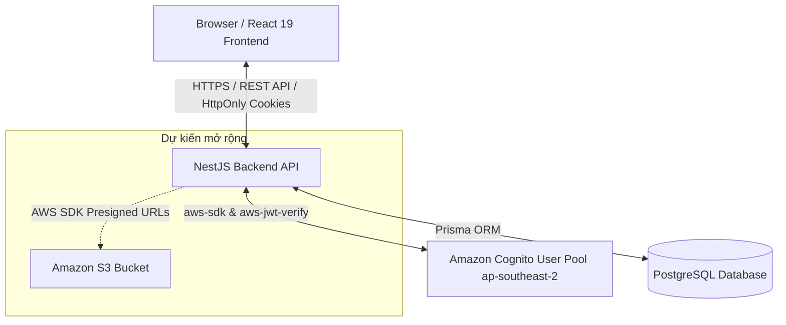

# Startups Blogs - Business Investment Connection Platform
## Nền tảng Kết nối Đầu tư và Quảng bá Doanh nghiệp Khởi nghiệp

---

### 1. Tóm tắt điều hành (Executive Summary)
**Startups Blogs** là một nền tảng ứng dụng web hiện đại được thiết kế nhằm thu hẹp khoảng cách kết nối giữa các Doanh nghiệp khởi nghiệp (Startups), Doanh nghiệp vừa và nhỏ (SMEs), Chủ doanh nghiệp (Business Owners) với các Nhà đầu tư (Investors) và Đối tác chiến lược (Enterprise Partners).

Hệ thống cho phép các doanh nghiệp tạo lập hồ sơ năng lực, công bố các cơ hội gọi vốn (Funding Opportunities), minh bạch hóa lộ trình sử dụng vốn và thu hút dòng vốn đầu tư. Đồng thời, nhà đầu tư có thể dễ dàng tìm kiếm, lọc và đánh giá các cơ hội đầu tư tiềm năng thông qua giao diện trực quan và dữ liệu được cấu trúc chuẩn hóa.

Dự án hiện đã hoàn thiện kiến trúc Full-Stack cơ bản với **React 19 (Vite, TypeScript)** ở Frontend, **NestJS (REST API, TypeScript)** ở Backend, **PostgreSQL & Prisma ORM** ở tầng dữ liệu và tích hợp **Amazon Cognito User Pool (`ap-southeast-2`)** cho toàn bộ quy trình xác thực người dùng bảo mật qua HttpOnly Cookies.

---

### 2. Tuyên bố vấn đề (Problem Statement)

#### Vấn đề hiện tại
- **Phân mảnh thông tin gọi vốn**: Các doanh nghiệp khởi nghiệp và doanh nghiệp vừa và nhỏ gặp nhiều khó khăn trong việc tiếp cận nhà đầu tư phù hợp. Thông tin doanh nghiệp và nhu cầu gọi vốn thường bị phân mảnh rải rác trên mạng xã hội, trang tin cá nhân, tệp bảng tính hoặc các kênh trao đổi riêng tư.
- **Thiếu cấu trúc dữ liệu đánh giá**: Nhà đầu tư thiếu một nền tảng tập trung, chuẩn hóa để tra cứu, so sánh và đánh giá các chỉ số tài chính, đội ngũ sáng lập cũng như cơ hội đầu tư.
- **Rủi ro an toàn thông tin & Phân quyền**: Thông tin đầu tư và tài liệu doanh nghiệp chứa nhiều thông tin nhạy cảm. Hệ thống cần giải pháp xác thực và phân quyền nghiêm ngặt để bảo vệ tài liệu hạn chế.

#### Giải pháp đề xuất
**Startups Blogs** cung cấp một nền tảng tập trung nơi:
- **Doanh nghiệp**: Đăng ký tài khoản, xác thực email, quản lý hồ sơ doanh nghiệp, công bố cơ hội gọi vốn, lập kế hoạch sử dụng vốn và tiếp cận nhà đầu tư.
- **Nhà đầu tư**: Đăng ký tài khoản nhà đầu tư, tra cứu danh sách doanh nghiệp, lọc cơ hội gọi vốn theo ngành nghề, quy mô vốn, giai đoạn phát triển và xem thông tin minh bạch.
- **Bảo mật hệ thống**: Tận dụng dịch vụ **Amazon Cognito** kết hợp với **HttpOnly Cookies** và **JWT Verification (`aws-jwt-verify`)** tại NestJS backend để đảm bảo an toàn tuyệt đối cho phiên làm việc.

---

### 3. Lợi ích giải pháp & ROI (Benefits & ROI)
- **Tối ưu hóa thời gian kết nối**: Rút ngắn thời gian tiếp cận giữa doanh nghiệp và nhà đầu tư từ vài tháng xuống còn vài ngày nhờ hệ thống tra cứu và lọc thông tin thông minh.
- **Minh bạch hóa hồ sơ đầu tư**: Chuẩn hóa dữ liệu hồ sơ doanh nghiệp, danh mục sử dụng vốn (Use of Funds) và điểm tin tài chính (Financial Highlights).
- **Bảo mật cấp doanh nghiệp**: Ủy quyền xác thực người dùng cho Amazon Cognito giúp loại bỏ rủi ro lưu trữ mật khẩu tại cơ sở dữ liệu nội bộ và bảo vệ chống tấn công XSS/CSRF bằng cơ chế HttpOnly Cookie.

---

### 4. Kiến trúc giải pháp (Solution Architecture)

#### Luồng xử lý xác thực (Authentication Flow)
1. **Đăng ký (Register)**: Người dùng chọn vai trò (`BUSINESS_OWNER`, `INVESTOR`, `ENTERPRISE_PARTNER`) → NestJS gửi lệnh `SignUpCommand` tới Cognito → Cognito gửi mã xác thực 6 chữ số qua Email → Người dùng nhập mã xác thực (`ConfirmSignUpCommand`) → Tài khoản chuyển trạng thái `ACTIVE` trong PostgreSQL.
2. **Đăng nhập (Login)**: Người dùng nhập Email/Password → NestJS tính toán `SECRET_HASH` (HMAC-SHA256) và gửi lệnh `USER_PASSWORD_AUTH` tới Cognito → Cognito trả về Access Token, ID Token & Refresh Token → NestJS lưu Token vào **HttpOnly Signed Cookies** (`sb_access_token`, `sb_id_token`, `sb_refresh_token`).
3. **Xác thực phiên (Session Validation - `/auth/me`)**: Frontend gửi request kèm HttpOnly Cookie → `CognitoAuthGuard` tại NestJS trích xuất token, giải mã và kiểm tra chữ ký RSA trực tiếp với Cognito JWKS via `aws-jwt-verify` → Truy vấn dữ liệu người dùng an toàn từ PostgreSQL.

---

### 5. Công nghệ sử dụng (Technology Stack)

#### Frontend (Đã triển khai)
- **React 19**, **TypeScript**, **Vite**
- **React Router v7** cho điều hướng trang
- **CSS Modules** cho quản lý giao diện
- **AuthContext** & **Custom Hooks** cho quản lý trạng thái xác thực

#### Backend (Đã triển khai)
- **NestJS**, **TypeScript**
- **Prisma ORM** quản lý tương tác cơ sở dữ liệu
- **PostgreSQL** lưu trữ dữ liệu nghiệp vụ
- **@aws-sdk/client-cognito-identity-provider** & **aws-jwt-verify**
- **@nestjs/throttler** chống tấn công Brute-force

#### Hạ tầng AWS (Đã triển khai & Tương lai)
- **Amazon Cognito (`ap-southeast-2`)**: *ĐÃ TRIỂN KHAI* (Quản lý User Pool, Client App, Email verification, Token lifecycle).
- **Amazon S3**: *DỰ KIẾN* (Lưu trữ tệp logo doanh nghiệp, tài liệu gọi vốn qua Presigned URLs).
- **Production AWS Deployment**: *DỰ KIẾN* (Kiến trúc triển khai Production trên AWS — sẽ chốt cấu hình chính thức ở giai đoạn tiếp theo).

---

### 6. Phân định tính năng: Đã triển khai vs Dự kiến (Feature Matrix)

| Hạng mục / Tính năng | Trạng thái triển khai | Ghi chú chi tiết |
| --- | :---: | --- |
| Cơ sở dữ liệu PostgreSQL & Schema Prisma | **ĐÃ TRIỂN KHAI** | Đã tạo Schema đầy đủ cho User, Business, FundingOpportunity, InvestorProfile, Industry, TeamMember... |
| REST API đọc dữ liệu (Read-only APIs) | **ĐÃ TRIỂN KHAI** | `GET /businesses`, `GET /funding-opportunities`, `GET /investors`, `GET /taxonomies/*` |
| Backend Xác thực Amazon Cognito | **ĐÃ TRIỂN KHAI** | Đăng ký, Đăng nhập, Xác thực Email, Refresh Session, Quên/Đặt lại mật khẩu, Log out |
| Bảo mật HttpOnly Signed Cookie & JWT Guard | **ĐÃ TRIỂN KHAI** | Tích hợp `aws-jwt-verify` kiểm tra chữ ký token RSA từ Cognito JWKS |
| Giao diện React & AuthContext | **ĐÃ TRIỂN KHAI** | Các trang Home, Explore, Details, Login, Register, Verify Email, Password Reset |
| Quy trình Gọi vốn 8 bước (Raise Capital Wizard) | **ĐÃ TRIỂN KHAI (FRONTEND)** | Form 8 bước có kiểm tra dữ liệu đầu vào và tự động lưu nháp vào `localStorage` |
| Phân quyền tuyến đường gọi vốn (Route Guard) | **ĐÃ TRIỂN KHAI** | Bảo vệ route `/raise-capital` chỉ cho phép `BUSINESS_OWNER` & `ENTERPRISE_PARTNER` |
| Lưu dữ liệu gọi vốn vào PostgreSQL (Write APIs) | **DỰ KIẾN (PLANNED)** | Các API `POST/PUT` tạo và chỉnh sửa Business / Funding Opportunity |
| Tải tệp lên Amazon S3 (Logo, Pitch Deck) | **DỰ KIẾN (PLANNED)** | Tích hợp Amazon S3 SDK và cấp quyền truy cập qua Presigned URLs |
| Yêu cầu xem tài liệu & Nhắn tin trao đổi | **DỰ KIẾN (PLANNED)** | Tính năng kết nối trực tiếp giữa Nhà đầu tư và Chủ doanh nghiệp |
| Dashboard Quản trị viên (Admin Moderation) | **DỰ KIẾN (PLANNED)** | Đuyệt hồ sơ doanh nghiệp và cơ hội gọi vốn trước khi công bố public |

> **Lưu ý về tài khoản ADMIN**: Đăng ký công khai trên hệ thống chỉ áp dụng cho 3 vai trò: `BUSINESS_OWNER`, `INVESTOR`, và `ENTERPRISE_PARTNER`. Vai trò `ADMIN` được quản lý và cấp phát nội bộ, không mở đăng ký tự do qua quy trình Public Register.

---

### 7. Yêu cầu kỹ thuật & An toàn thông tin (Security Requirements)
1. **Không lưu trữ mật khẩu tại PostgreSQL**: Mật khẩu người dùng được quản lý hoàn toàn bởi Amazon Cognito User Pool.
2. **Khóa Client Secret an toàn**: `COGNITO_CLIENT_SECRET` được bảo vệ ở phía NestJS Server, sử dụng thuật toán HMAC-SHA256 để tạo `SECRET_HASH`.
3. **Bảo vệ Cookie HttpOnly**: Token xác thực được lưu trong HttpOnly Signed Cookie, ngăn chặn các cuộc tấn công đánh cắp token qua XSS.
4. **Giới hạn tần suất request (Rate Limiting)**: Sử dụng ThrottlerGuard tại AuthController để ngăn chặn rủi ro dò mật khẩu và rác hệ thống.
5. **Không để lộ khóa bí mật**: Các tham số `.env`, AWS Account ID, Secret Key đều không được hiển thị trong mã nguồn công khai hoặc tài liệu workshop.

---

### 8. Ước tính chi phí (Cost Considerations)
> **Thông báo**: Chi phí chính thức sẽ được tính toán chi tiết bằng công cụ **AWS Pricing Calculator** dựa trên kiến trúc triển khai Production hoàn chỉnh.

Các danh mục chi phí AWS liên quan bao gồm:
- **Amazon Cognito**: Miễn phí cho 50,000 MAUs (Monthly Active Users) đầu tiên trong gói AWS Free Tier.
- **Amazon S3** *(Dự kiến)*: Chi phí lưu trữ theo GB/tháng và số lượng request PUT/GET.
- **Dịch vụ Hosting & Database** *(Dự kiến)*: Tính theo cấu hình tài nguyên thực tế khi triển khai.

---

### 9. Đánh giá rủi ro & Biện pháp giảm thiểu (Risk Assessment)

| Rủi ro | Mức độ | Biện pháp giảm thiểu |
| --- | :---: | --- |
| Lộ mật khẩu / Token người dùng | **Cao** | Ủy quyền xác thực hoàn toàn cho Amazon Cognito & dùng HttpOnly Cookie |
| Đăng ký rác / Spam tài khoản | **Trung bình** | Bắt buộc xác thực Email qua mã 6 chữ số từ Cognito & áp dụng Rate Limiting |
| Xâm nhập trái phép trang gọi vốn | **Cao** | Áp dụng `ProtectedRoute` và `CognitoAuthGuard` kiểm tra vai trò người dùng |
| Trôi dạt dữ liệu form gọi vốn | **Thấp** | Tự động lưu bản nháp vào `localStorage` của trình duyệt |

---

### 10. Kết quả kỳ vọng (Expected Outcomes)
- Xây dựng thành công hệ thống kết nối đầu tư chuẩn hóa cho các Startup và doanh nghiệp vừa và nhỏ.
- Chứng minh khả năng tích hợp giải pháp xác thực đám mây **Amazon Cognito** vào hệ thống Full-Stack (NestJS + React + PostgreSQL).
- Đảm bảo tính mở rộng cao cho việc tích hợp thêm các dịch vụ AWS khác (như Amazon S3) trong các giai đoạn phát triển tiếp theo.