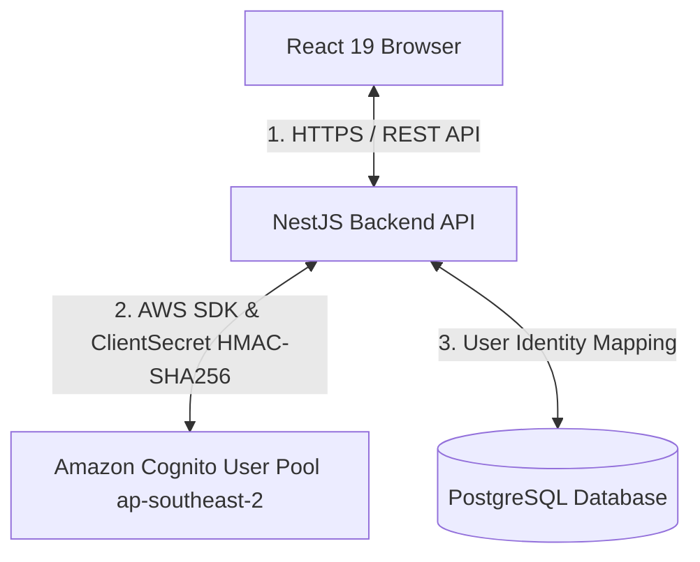
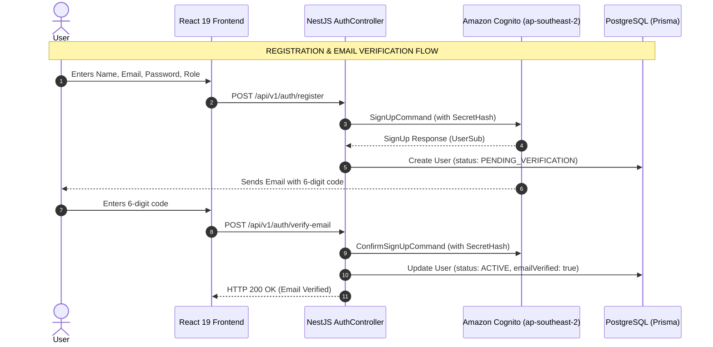

# BUILDING SECURE AUTHENTICATION WITH AMAZON COGNITO FOR A REACT AND NESTJS APPLICATION
## Challenges & Solutions in Building Enterprise Cloud Authentication for Full-Stack Applications

### 1. Introduction
In modern web application design, identity management and authentication represent critical components that carry significant cybersecurity risks.

For the **Startups Blogs** platform (connecting Startups, Business Owners, Investors, and Enterprise Partners), investment profiles and financial data require robust protection. Rather than building custom password storage and hashing mechanisms in an internal database, the project adopted **Amazon Cognito User Pool** in the `ap-southeast-2` region as its identity management solution.

This article details how **Amazon Cognito** is integrated into a full-stack architecture featuring **React 19 (Vite, TypeScript)** on the frontend, **NestJS REST API** on the backend, and **PostgreSQL (Prisma ORM)** at the database layer.

---

### 2. Why Route Authentication Through NestJS Instead of Calling Cognito Directly from the Browser?

A foundational architectural decision of Startups Blogs is **never to call Amazon Cognito SDK directly from the React browser app**. All authentication requests (Registration, Email Verification, Login, Session Refresh, Password Reset) are proxied through the **NestJS Backend Controller**.

#### Core Technical Rationale:
1. **Absolute Protection of Cognito Client Secret**:
   To prevent client spoofing, the Cognito App Client is configured as a **Confidential Client** requiring a `Client Secret`. If a React Single Page Application (SPA) directly called Cognito, the `Client Secret` would be embedded in client JavaScript bundles, easily extracted via browser Developer Tools. Routing requests through NestJS isolates the `Client Secret` securely on the server (`process.env.COGNITO_CLIENT_SECRET`).
2. **Preventing Client Token Storage Vulnerabilities (XSS Mitigation)**:
   If React called Cognito directly, returned tokens (`AccessToken`, `IdToken`, `RefreshToken`) would typically be stored in browser `localStorage` or `sessionStorage`, leaving them vulnerable to theft via Cross-Site Scripting (XSS). With NestJS acting as the intermediary, tokens are attached as server-side **HttpOnly Signed Cookies** inaccessible to JavaScript.
3. **Identity Synchronization with Business Data**:
   Users in Startups Blogs require extended domain attributes (`role`: `BUSINESS_OWNER`, `INVESTOR`, `ENTERPRISE_PARTNER`, verification status, company profiles) stored in PostgreSQL. NestJS executes atomic orchestrations: registering the identity with Cognito while generating a matching `User` record in PostgreSQL linked by a unique `cognitoSub`.

---

### 3. Comprehensive Authentication Flows

#### A. Public Self-Registration Boundary
- **Role Registration Boundaries**: Public web self-registration is strictly limited to 3 roles: `BUSINESS_OWNER`, `INVESTOR`, and `ENTERPRISE_PARTNER`. The `ADMIN` role is managed internally and **cannot be publicly registered**.
- Upon submission, NestJS receives the request at `AuthController.register()` and triggers `CognitoService.signUp()`.
- Cognito automatically dispatches a verification email containing a 6-digit code.
- Concurrently, NestJS creates a `User` record in PostgreSQL marked `PENDING_VERIFICATION`.

#### B. Email Verification
- The user inputs the 6-digit code at `VerifyEmail.tsx`.
- NestJS receives `POST /api/v1/auth/verify-email` and issues `ConfirmSignUpCommand` to Cognito.
- Upon successful confirmation, NestJS updates the user record in PostgreSQL to `ACTIVE` and `emailVerified: true`.

#### C. Login & Session Creation
- User submits credentials at `Login.tsx`.
- NestJS calculates `SECRET_HASH` via HMAC-SHA256 using `COGNITO_CLIENT_SECRET` and calls `InitiateAuthCommand` under the `USER_PASSWORD_AUTH` flow.
- Upon successful credential verification, Cognito issues `AccessToken`, `IdToken`, and `RefreshToken`.
- NestJS packages these tokens into **HttpOnly Signed Cookies** sent to the client browser.

---

### 4. Conclusion
By proxying all authentication requests through the NestJS backend, **Startups Blogs** establishes a robust security posture:
- Isolating `COGNITO_CLIENT_SECRET` on the server.
- Eliminating XSS token theft risks via HttpOnly Signed Cookies.
- Ensuring synchronization between Cognito cloud identities and PostgreSQL application records.

In the next article (Blog 2), we will explore the mathematical generation of **SecretHash HMAC-SHA256** and cryptographic RSA JWT signature verification using **`aws-jwt-verify`**.