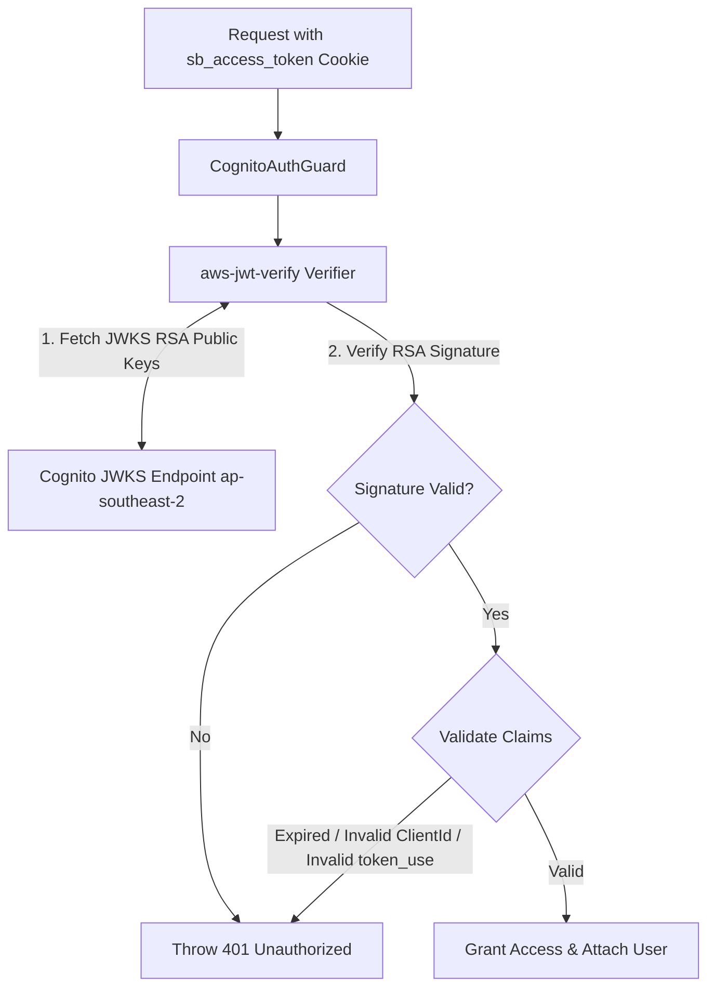

# SECURING AMAZON COGNITO AUTHENTICATION WITH SECRETHASH AND JWT VERIFICATION IN NESTJS
## Robust Backend Security Mechanisms via HMAC-SHA256 SecretHash and RSA JWT Signature Verification

### 1. Introduction
In enterprise applications utilizing an **Amazon Cognito Confidential App Client**, securing communication between the backend server and Cognito User Pools requires strict cryptographic hashing and token validation techniques.

This article analyzes two core security mechanisms implemented in the NestJS backend of **Startups Blogs**:
1. **Cognito SecretHash Generation (HMAC-SHA256)** when calling AWS Cognito SDK commands.
2. **Cryptographic JWT Signature Verification using `aws-jwt-verify`**, explaining why simply decoding a JWT payload is insufficient for security.

---

### 2. Computing Cognito SecretHash via HMAC-SHA256

When a Cognito App Client is provisioned with a `Client Secret`, Cognito mandates that all authentication API requests (such as `SignUp`, `ConfirmSignUp`, `InitiateAuth`, `ForgotPassword`) include a `SECRET_HASH` attribute.

#### Mathematical Formula & Algorithm
`SecretHash` is a Base64-encoded string computed using the **HMAC-SHA256** algorithm, where:
- **Key**: `COGNITO_CLIENT_SECRET` (The App Client Secret).
- **Message**: The concatenation of the user's `Username` (Email) and `COGNITO_CLIENT_ID`.

$$\text{SecretHash} = \text{Base64}\left( \text{HMAC-SHA256}\left( \text{ClientSecret}, \text{Username} + \text{ClientId} \right) \right)$$

#### NestJS Source Code Implementation (`cognito-secret-hash.ts`)
```typescript
import * as crypto from 'crypto';

export function generateCognitoSecretHash(
  username: string, 
  clientId: string, 
  clientSecret: string
): string {
  return crypto
    .createHmac('SHA256', clientSecret)
    .update(username + clientId)
    .digest('base64');
}
```

#### Application in `CognitoService`
Before executing AWS SDK commands (such as `InitiateAuthCommand` under `USER_PASSWORD_AUTH`), NestJS invokes `getSecretHash(email)` to compute the hash and supply it inside `AuthParameters`:

```typescript
async login(email: string, password: string): Promise<CognitoTokens> {
  const secretHash = this.getSecretHash(email);
  const command = new InitiateAuthCommand({
    AuthFlow: AuthFlowType.USER_PASSWORD_AUTH,
    ClientId: this.clientId,
    AuthParameters: {
      USERNAME: email,
      PASSWORD: password,
      SECRET_HASH: secretHash,
    },
  });

  const response = await this.cognitoClient.send(command);
  // Parses and returns AccessToken, IdToken, RefreshToken
}
```

---

### 3. JWT Signature Verification using `aws-jwt-verify`

When a client sends an authentication request to the NestJS backend, the server must cryptographically verify whether the token was legitimately issued by the **Amazon Cognito User Pool** (`ap-southeast-2`).

#### Why Simply Decoding a JWT (`jwt.decode()`) is INSECURE
A common mistake is using `jwt.decode()` or `JSON.parse(atob(token.split('.')[1]))` to read payload claims.
- **Decoding** merely converts Base64Url strings to JSON; **it performs zero verification of origin or integrity**.
- Attackers can craft arbitrary JSON payloads with spoofed `sub` or `email` values, Base64-encode them, and send them to the server. Without signature verification, the backend would accept forged tokens.

#### RSA Signature Verification via JWKS (JSON Web Key Set)
Cognito JWTs are signed using **RS256** (RSA Signature with SHA-256).
- Cognito publishes public keys at a standard JWKS endpoint:
  `https://cognito-idp.ap-southeast-2.amazonaws.com/<userPoolId>/.well-known/jwks.json`
- To validate a token, the backend fetches JWKS keys, matches the token header's `kid` (Key ID), and uses the public key to verify the RSA signature.



#### NestJS Implementation (`cognito.service.ts` & `cognito-auth.guard.ts`)
**Startups Blogs** uses the official `aws-jwt-verify` library from AWS to handle JWKS key caching and validate 5 mandatory security criteria:

1. **RSA Signature**: Verifies token was signed by the genuine Cognito User Pool key.
2. **Expiration (`exp`)**: Validates token has not expired.
3. **Token Use (`token_use`)**: Ensures `token_use === 'access'`.
4. **App Client ID (`client_id`)**: Matches system `COGNITO_CLIENT_ID`.
5. **Issuer (`iss`)**: Matches Cognito Region `ap-southeast-2` issuer URL.

```typescript
// Inside CognitoService (Initialization)
this.jwtVerifier = CognitoJwtVerifier.create({
  userPoolId: this.userPoolId,
  tokenUse: 'access',
  clientId: this.clientId,
});

// Inside CognitoAuthGuard
async canActivate(context: ExecutionContext): Promise<boolean> {
  const request = context.switchToHttp().getRequest();
  const accessToken = request.signedCookies?.sb_access_token || request.cookies?.sb_access_token;

  if (!accessToken) {
    throw new UnauthorizedException('Access token missing');
  }

  try {
    // Cryptographically verifies RSA signature and claims
    const payload = await this.cognitoService.verifyAccessToken(accessToken);
    
    // Safely retrieves user profile from PostgreSQL
    const user = await this.prisma.user.findUnique({
      where: { email: payload.username },
    });

    request.user = user;
    return true;
  } catch (error) {
    throw new UnauthorizedException('Invalid or expired authentication token');
  }
}
```

---

### 4. Conclusion
Combining **SecretHash (HMAC-SHA256)** for outbound SDK requests and **`aws-jwt-verify` (RSA JWKS Verification)** for inbound API authorization grants **Startups Blogs** an enterprise security baseline:
- Complete isolation of Client Secrets.
- Total defense against forged JWT tokens.
- Protection of protected application routes.

In Blog 3, we will explore **HttpOnly Signed Cookies**, **Refresh Token** flows, and Role-Based Access Control (RBAC) integrated with PostgreSQL user roles.