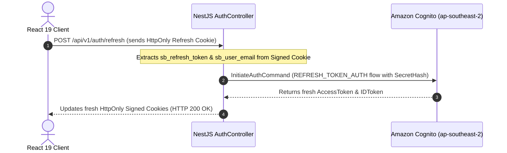

# MANAGING AMAZON COGNITO SESSIONS WITH HTTPONLY COOKIES, REFRESH TOKENS, AND ROLE-BASED ACCESS CONTROL
## Enterprise Session Management and Role-Based Authorization Architecture

### 1. Introduction
Once user credentials are successfully authenticated against **Amazon Cognito**, the next critical question arises: *How do we securely manage user sessions?*

For React Single Page Applications (SPAs), storing JWT Access Tokens or Refresh Tokens inside browser `localStorage` represents a primary attack vector for credential theft via **Cross-Site Scripting (XSS)** vulnerabilities.

This article details the session management architecture implemented in the **Startups Blogs** platform:
- Token storage inside server-side **HttpOnly Signed Cookies**.
- Session continuation via **Refresh Token authentication (`REFRESH_TOKEN_AUTH`)**.
- Logout and token revocation mechanisms.
- Combining Cognito identity authentication with **Role-Based Access Control (RBAC)** in PostgreSQL to protect fundraising features.

---

### 2. Session Security via HttpOnly Signed Cookies

Rather than returning raw JWT strings to client JavaScript, NestJS packages Cognito tokens into **HttpOnly Signed Cookies** with strict security flags:

```typescript
// Inside AuthController.ts
private getCookieOptions(maxAgeMs?: number) {
  return {
    httpOnly: true,                                         // Prevents client JavaScript (document.cookie) from accessing tokens
    secure: process.env.COOKIE_SECURE === 'true',           // Enforces HTTPS transport in Production environments
    sameSite: (process.env.COOKIE_SAME_SITE as any) || 'lax',// Guards against Cross-Site Request Forgery (CSRF)
    path: '/',
    signed: true,                                           // Signs cookies with a server secret to prevent tampering
    ...(maxAgeMs !== undefined && { maxAge: maxAgeMs }),
  };
}
```

#### Token Storage Comparison: `localStorage` vs `HttpOnly Cookie`

| Comparison Metric | Browser `localStorage` | Server-Side HttpOnly Cookie |
| --- | :---: | :---: |
| Accessible via JavaScript (`document.cookie`) | ⚠️ Yes (High Risk) | ✅ No (Total Protection) |
| Vulnerable to XSS Token Theft | ⚠️ Extreme | ✅ Immune to XSS reading |
| Protection against CSRF | ✅ Natural if attached via header | ✅ Protected via `SameSite=Lax` & Signed Cookies |
| Automatic Request Dispatch | ❌ Requires JS code to attach headers | ✅ Browser attaches automatically by domain |

---

### 3. Refresh Token Flow (`REFRESH_TOKEN_AUTH`)

Cognito Access Tokens expire after 1 hour by default. When an Access Token expires, users do not need to re-enter passwords. The backend automatically renews tokens via the `sb_refresh_token` cookie.



#### Logout & Token Revocation (`GlobalSignOut` & `RevokeToken`)
When a user clicks **Logout**, NestJS performs two security steps:
1. Issues `RevokeTokenCommand` and `GlobalSignOutCommand` to Cognito to invalidate the Refresh Token on the AWS cloud.
2. Clears all HttpOnly cookies on the browser via `response.clearCookie()`.

---

### 4. Combining Cognito Identity with PostgreSQL Role-Based Access Control (RBAC)

In **Startups Blogs**, Cognito acts as the Identity Provider, while **PostgreSQL** stores domain user roles (`UserRole` enum):
- `BUSINESS_OWNER`: Startup Founders / Owners.
- `INVESTOR`: Investors / Angel Investors.
- `ENTERPRISE_PARTNER`: Strategic Enterprise Partners.
- `ADMIN`: Platform Administrators (**Not publicly registrable**).

#### Protected Capital Raising Route (`RaiseCapital`)
The `/raise-capital` view renders an 8-step wizard form guarded at both frontend and backend layers:

- **Frontend ProtectedRoute (`App.tsx`)**:
```tsx
<Route
  path="raise-capital"
  element={
    <ProtectedRoute allowedRoles={['BUSINESS_OWNER', 'ENTERPRISE_PARTNER']}>
      <RaiseCapital />
    </ProtectedRoute>
  }
/>
```

- **Feature Boundary Status**:
  - **IMPLEMENTED**: `ProtectedRoute` guard, 8-step wizard form, input validation, and `localStorage` draft auto-saving.
  - **PLANNED FOR FUTURE PHASES**: PostgreSQL persistence (Backend Write APIs `POST/PUT`) and Amazon S3 presigned URL file uploads.

---

### 5. Conclusion
Managing user sessions via **HttpOnly Signed Cookies** combined with Amazon Cognito's **Refresh Token flow** and PostgreSQL **RBAC authorization** affords **Startups Blogs** an optimal balance between **User Experience (UX)** and **Enterprise Security**:
- Seamless session continuation without user disruption.
- Total defense against XSS token theft.
- Strict role-based authorization protecting application features.