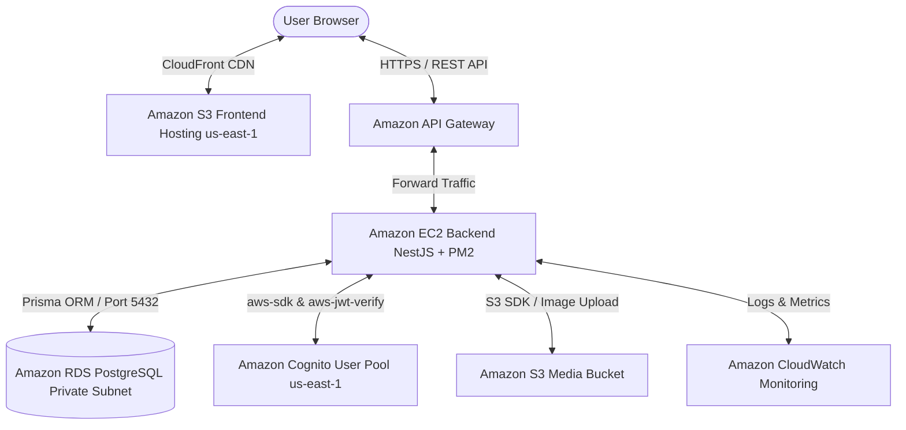

### Workshop Overview & Enterprise AWS Architecture

In this section, we cover the overall architecture of **Startups Blogs** and the cloud authentication flow powered by **Amazon Cognito (`us-east-1`)**.

#### 1. Enterprise AWS Architecture Diagram
The system is built according to Enterprise Microservices & Serverless best practices, isolating Frontend, Backend, Database, and Identity Management. 100% of the infrastructure is automated via **Terraform** (Infrastructure as Code).

#### 2. User Roles & Registration Boundary
The system defines 4 major roles (`UserRole`):
- **`BUSINESS_OWNER`**: Public self-registration. Manages business profiles and funding listings.
- **`INVESTOR`**: Public self-registration. Explores, searches, and evaluates investment opportunities.
- **`ENTERPRISE_PARTNER`**: Public self-registration. Participates in strategic partnerships and joint ventures.
- **`ADMIN`**: **NOT publicly registrable**. Synchronized with Cognito User Pool Group `ADMIN` via `CognitoGroupsService`. Administrators utilize the Admin Dashboard to approve business listings (`PUT /businesses/admin/:id/status`), moderate articles, and process Change Proposals.

#### 3. Implemented vs Planned Feature Matrix
- **IMPLEMENTED AND VERIFIED**:
  - Complete Terraform IaC codebase inside `terraform/` (Region: `us-east-1`).
  - Amazon RDS PostgreSQL & Prisma ORM Schema.
  - Business Write & Read APIs (`POST/GET/PUT/DELETE /businesses`).
  - Funding Opportunity APIs (`POST/GET/PUT/DELETE /businesses/:businessId/funding-opportunities`).
  - S3 Media Uploads (`POST /upload`).
  - Amazon Cognito Auth, SecretHash HMAC-SHA256, and Cognito Group `ADMIN` synchronization.
  - HttpOnly Signed Cookie security & RSA Token signature verification via `aws-jwt-verify` against JWKS `us-east-1`.
  - React 19 Frontend, Zustand state, Admin Dashboard (`/admin/*`), and Change Proposals.
  - Contact Requests (`POST /businesses/:businessId/contact-requests`).
- **PLANNED**:
  - Real-time Notification System (Notification Schema & WebSocket/polling).
  - Advanced multi-tier funding approval workflow.
  - Expanded automated E2E test coverage.

> Screenshot required:
> Startups Blogs System Architecture and Cognito Auth Flow Diagram.
> Hide AWS account identifiers and sensitive values before capturing.