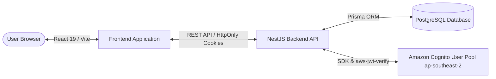

### Workshop Overview & Startups Blogs Architecture

In this section, we cover the overall architecture of **Startups Blogs** and the cloud authentication flow powered by **Amazon Cognito**.

#### 1. System Overview
Startups Blogs solves the investment matchmaking fragmentation problem by providing structured data for startups, small businesses, and investors.

#### 2. User Roles & Registration Boundary
The system defines 4 major roles (`UserRole`):
- **`BUSINESS_OWNER`**: Public self-registration. Manages business profiles and funding listings.
- **`INVESTOR`**: Public self-registration. Explores, searches, and evaluates investment opportunities.
- **`ENTERPRISE_PARTNER`**: Public self-registration. Participates in strategic partnerships and joint ventures.
- **`ADMIN`**: **NOT publicly registrable**. Internal platform administration role assigned out-of-band.

#### 3. Implemented vs Planned Feature Matrix
- **IMPLEMENTED**:
  - PostgreSQL Database & Prisma ORM Schema.
  - Read-only REST APIs (`GET /businesses`, `GET /funding-opportunities`, `GET /investors`, `GET /taxonomies/*`).
  - Full Amazon Cognito Auth Backend (`Register`, `Verify Email`, `Login`, `Refresh`, `Logout`, `Forgot Password`).
  - HttpOnly Signed Cookie security & RSA Token signature verification via `aws-jwt-verify`.
  - React Frontend, AuthContext, and Protected Route guard (`ProtectedRoute`).
  - 8-Step Raise Capital wizard with form validation and `localStorage` draft auto-save.
- **PLANNED (FUTURE PHASES)**:
  - Amazon S3 integration for business logo, cover, avatar uploads, and document storage via Presigned URLs.
  - Backend Write APIs (`POST/PUT`) to persist Raise Capital submissions in PostgreSQL.
  - Investor document access requests & direct messaging.
  - Admin moderation dashboard.
  - Future production AWS deployment architecture — to be finalized.

> Screenshot required:
> Startups Blogs System Architecture and Cognito Auth Flow Diagram.
> Hide AWS account identifiers and sensitive values before capturing.