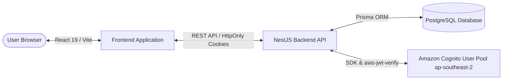

### Tổng quan bài lab & Kiến trúc ứng dụng Startups Blogs

Trong bài hướng dẫn này, chúng ta sẽ tìm hiểu kiến trúc tổng thể của hệ thống **Startups Blogs** và luồng xác thực đám mây bằng **Amazon Cognito**.

#### 1. Tổng quan hệ thống Startups Blogs
Startups Blogs giải quyết bài toán kết nối thông tin đầu tư giữa các Doanh nghiệp/Startup và Nhà đầu tư thông qua dữ liệu được cấu trúc chuẩn hóa.

#### 2. Phân định rõ các vai trò và phạm vi đăng ký
Hệ thống quản lý 4 vai trò người dùng chính (`UserRole`):
- **`BUSINESS_OWNER`**: Đăng ký công khai. Quản lý hồ sơ doanh nghiệp và tạo nhu cầu gọi vốn.
- **`INVESTOR`**: Đăng ký công khai. Tìm kiếm, tra cứu và đánh giá các cơ hội đầu tư.
- **`ENTERPRISE_PARTNER`**: Đăng ký công khai. Tham gia hợp tác chiến lược và đồng đầu tư.
- **`ADMIN`**: **Không mở đăng ký công khai**. Quản trị viên hệ thống được cấp phát nội bộ để duyệt hồ sơ và kiểm duyệt nền tảng.

#### 3. Phân định tính năng Thực tế (Implemented) vs Tương lai (Planned)
- **ĐÃ TRIỂN KHAI (IMPLEMENTED)**:
  - Cơ sở dữ liệu PostgreSQL & Prisma ORM Schema.
  - REST APIs đọc dữ liệu công khai (`GET /businesses`, `GET /funding-opportunities`, `GET /investors`, `GET /taxonomies/*`).
  - Toàn bộ backend xác thực Amazon Cognito (`Register`, `Verify Email`, `Login`, `Refresh`, `Logout`, `Forgot Password`).
  - Bảo mật HttpOnly Signed Cookie & kiểm tra chữ ký RSA Token qua `aws-jwt-verify`.
  - Giao diện React Frontend, AuthContext và Tuyến đường bảo vệ gọi vốn (`ProtectedRoute`).
  - Giao diện Form Gọi vốn 8 bước (`RaiseCapital`) kiểm tra dữ liệu và lưu bản nháp vào `localStorage`.
- **DỰ KIẾN TƯƠNG LAI (PLANNED)**:
  - Tích hợp Amazon S3 để tải tệp logo doanh nghiệp, ảnh đại diện và tài liệu gọi vốn qua Presigned URLs.
  - Các Backend Write APIs (`POST/PUT`) để lưu dữ liệu gọi vốn vào PostgreSQL.
  - Yêu cầu truy cập tài liệu hạn chế & Nhắn tin giữa Nhà đầu tư và Chủ doanh nghiệp.
  - Dashboard Quản trị viên (Admin Moderation).
  - Kiến trúc triển khai Production trên AWS — sẽ chốt cấu hình chính thức ở giai đoạn tiếp theo.

> Screenshot required:
> Sơ đồ tổng quan kiến trúc hệ thống Startups Blogs và Cognito Auth Flow.
> Hide AWS account identifiers and sensitive values before capturing.
