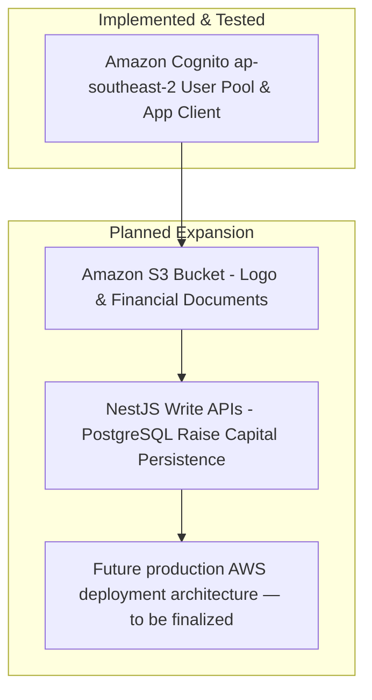

### Security Review & Future AWS Expansion Roadmap

In this section, we summarize the security controls implemented and outline the future AWS services expansion roadmap.

#### 1. Security Best Practices Review

- **Zero DB Credentials Storage**: Password authentication is entirely offloaded to Amazon Cognito.
- **Server-Side Secret Protection**: `COGNITO_CLIENT_SECRET` remains strictly on the NestJS backend, utilizing HMAC-SHA256 `SECRET_HASH` for all auth commands.
- **Mitigating XSS & CSRF via HttpOnly Signed Cookies**:
  - `httpOnly: true` prevents client-side JavaScript access (`document.cookie`).
  - `sameSite: 'lax'` protects against Cross-Site Request Forgery.
  - `signed: true` guarantees cookie payload integrity via express cookie secret.
- **Rate Limiting Protection**: `@nestjs/throttler` applied on `AuthController` endpoints to prevent brute-force attacks.
- **Zero Secrets Exposure**: Real `.env` parameters, AWS credentials, Client Secrets, and tokens are strictly excluded from repository content.

---

#### 2. Future AWS Services Expansion Roadmap

1. **Amazon S3 Integration (PLANNED)**:
   - Configure S3 bucket for business logos, cover photos, and pitch deck storage.
   - Implement **Presigned URLs** for direct, secure file uploads from client browser to S3.
   - Enforce fine-grained document visibility rules (`PUBLIC`, `VERIFIED_INVESTORS`, `APPROVED_ACCESS`, `PRIVATE`).

2. **Backend Write APIs (PLANNED)**:
   - Build `POST/PUT /businesses` and `POST/PUT /funding-opportunities` endpoints to persist Raise Capital 8-step wizard data in PostgreSQL.

3. **Production AWS Deployment Architecture (PLANNED)**:
   - *Future production AWS deployment architecture — to be finalized.*

> Screenshot required:
> Architecture diagram showing Amazon Cognito integration alongside planned Amazon S3 integration.
> Hide AWS account identifiers and sensitive values before capturing.
