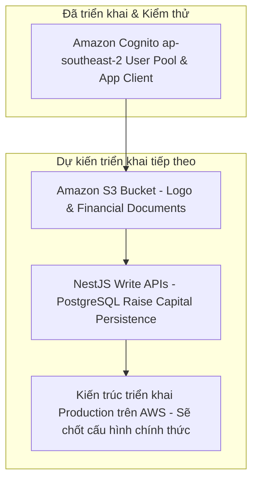

### Rà soát Bảo mật & Định hướng Mở rộng Dịch vụ AWS

Trong phần này, chúng ta tổng kết các biện pháp bảo mật đã áp dụng và vạch ra định hướng tích hợp thêm các dịch vụ AWS nâng cao trong tương lai.

#### 1. Rà soát Nguyên tắc Bảo mật (Security Review)

- **Không lưu Mật khẩu & Credential trong DB**: Ủy quyền hoàn toàn cho Amazon Cognito User Pool.
- **Bảo vệ Secret Key Server-side**: `COGNITO_CLIENT_SECRET` được bảo vệ ở NestJS backend và tính toán `SECRET_HASH` bằng HMAC-SHA256 cho mỗi thao tác auth.
- **Chống tấn công XSS/CSRF bằng HttpOnly Signed Cookies**:
  - `httpOnly: true` ngăn chặn JavaScript truy cập token từ `document.cookie`.
  - `sameSite: 'lax'` chống lại các cuộc tấn công Cross-Site Request Forgery.
  - `signed: true` đảm bảo tính toàn vẹn của cookie thông qua Secret Cookie Parser.
- **Giới hạn tần suất request (Rate Limiting)**: Áp dụng `@nestjs/throttler` tại `AuthController` để chống tấn công dò quét mật khẩu và Spam request.
- **Không để lộ bí mật hệ thống**: Tuyệt đối không hiển thị tệp `.env`, AWS Secret Access Key, Cognito Secret hay JWT tokens thực tế trên tài liệu hoặc giao diện người dùng.

---

#### 2. Lộ trình Mở rộng Dịch vụ AWS trong Tương lai (Future AWS Expansion Roadmap)

1. **Tích hợp Amazon S3 (PLANNED)**:
   - Tạo S3 Bucket cho tài liệu gọi vốn và hình ảnh doanh nghiệp.
   - Triển khai cơ chế **Presigned URLs** để phía Client tải tệp trực tiếp lên S3 an toàn mà không thông qua EC2/Backend server.
   - Thiết lập quyền truy cập theo từng mức độ `DocumentVisibility` (`PUBLIC`, `VERIFIED_INVESTORS`, `APPROVED_ACCESS`, `PRIVATE`).

2. **Hoàn thiện Backend Write APIs (PLANNED)**:
   - Xây dựng các API `POST/PUT /businesses` và `POST/PUT /funding-opportunities` để lưu thông tin từ form gọi vốn 8 bước vào PostgreSQL.

3. **Kiến trúc triển khai Production trên AWS (PLANNED)**:
   - *Kiến trúc triển khai Production trên AWS — sẽ chốt cấu hình chính thức ở giai đoạn tiếp theo.*

> Screenshot required:
> Architecture diagram showing Amazon Cognito integration alongside planned Amazon S3 integration.
> Hide AWS account identifiers and sensitive values before capturing.
